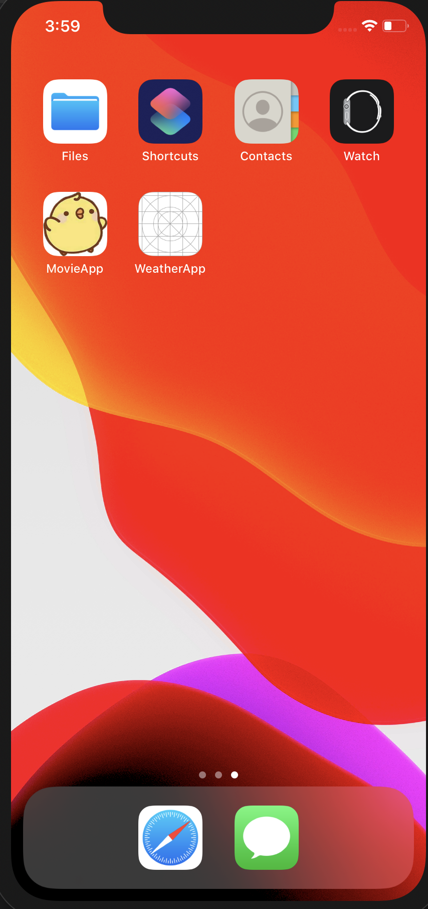

## 앱 아이콘

앱에 아이콘을 적용하기 위해 generator-rn-toolbox를 사용한다.

## generator-rn-toolbox

```
npm install -g yo generator-rn-toolbox
```

## imagemagick

generator-rn-toolbox로 이미지를 생성하기 위해 imagemagick 라이브러리 설치

```
brew install imagemagick

```

## 아이콘 생성

앱 아이콘을 생성하기 위해서 1024 x 1024 사이즈의 png 형식의 이미지 파일이 필요하다. 파일을 준비하고, ./src/Assets/Images/app_icon.png로 이름 변경 후 복사하고 generator-rn-toolbox로 아이콘 생성

```
yo rn-toolbox:assets --icon ./src/Assets/Images/app_icon.png
```

프로젝트 명을 물어보면 enter 덮어쓸지 물어보면 y

병아리 앱 아이콘을 확인할 수 있다.

## 스플래시 스크린 이미지

스플래시 스크린 이미지를 생성하기 위해서는 2208 x 2208 px 사이즈의 psd파일이 필요하다. psd 파일이 없으면 다음 사이트를 이용하여 psd파일 생성

```
phtopea: https://www.photopea.com
```

psd 파일을 ./src/Assets/Images/app_splash.psd로 변경한다. 다음 명령어로 각 OS에 맞는 스플래시 스크린 이미지 생성

```
yo rn-toolbox:assets --splash ./src/Assets/Images/app_splash.psd
```

프로젝트명을 물어보면 엔터 후 y로 덮어씌우기

## 안드로이드 확인

./android/app/src/main/res/values/styles.xml 에서 설정 코드 확인

```xml
<resources>
    <style name="AppTheme" parent="Theme.AppCompat.Light.NoActionBar">
        <item name="android:windowExitAnimation">@android:anim/fade_out</item>
        <item name="android:windowBackground">@drawable/launch_screen</item>
    </style>
</resources>
```

@drawable/launch_screen으로 설정 되어있는지 확인한다. @drawable/launch_screen_bitmap으로 설정이 되어있다면, launch_screen으로 수정한다.

gerator-rn-toolbox 개발자가 이제 새로운 라이브러리를 출시하고 generator-rn-toolbox 라이브러리를 지원하지 않게 되었다. 새롭게 개발한 라이브러리는 react-native-make 이다.

```
https://github.com/bamlab/react-native-make
```
